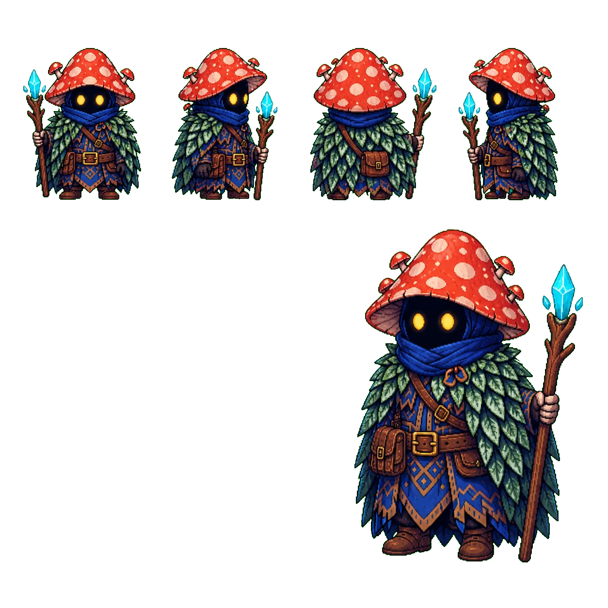
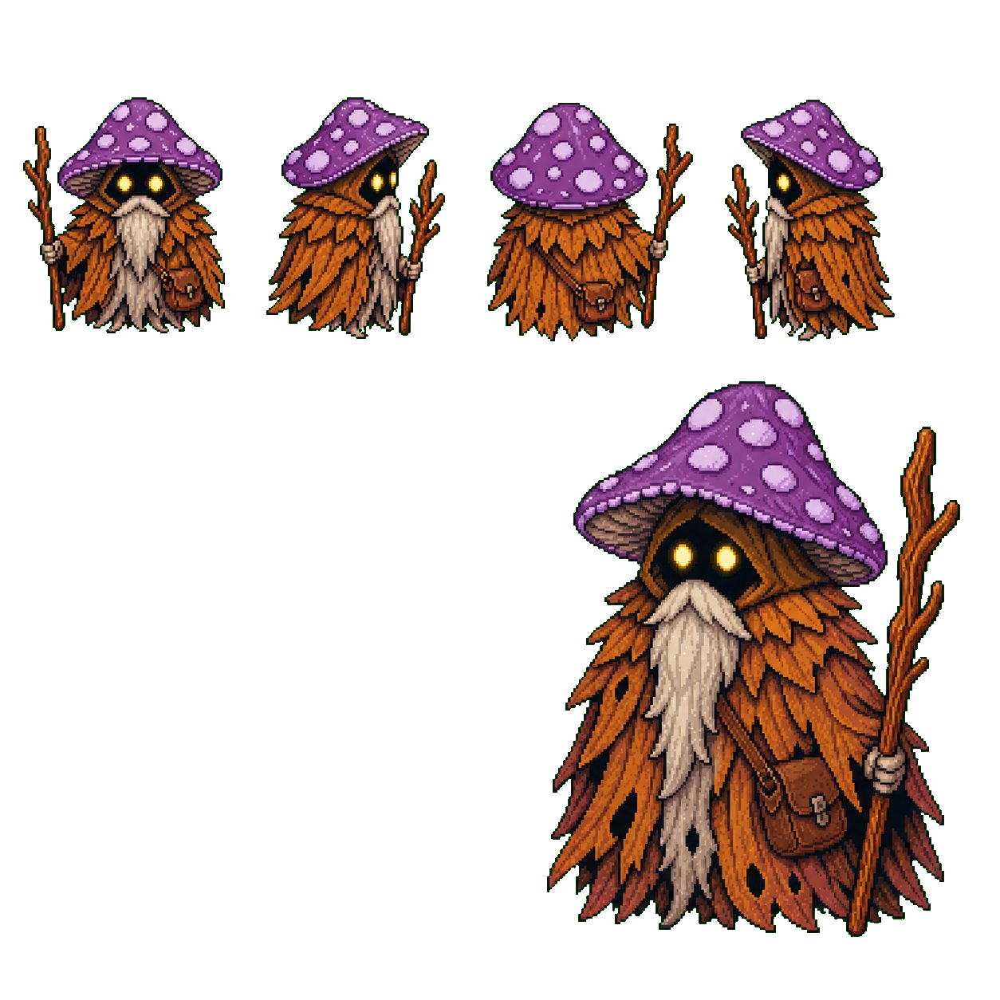
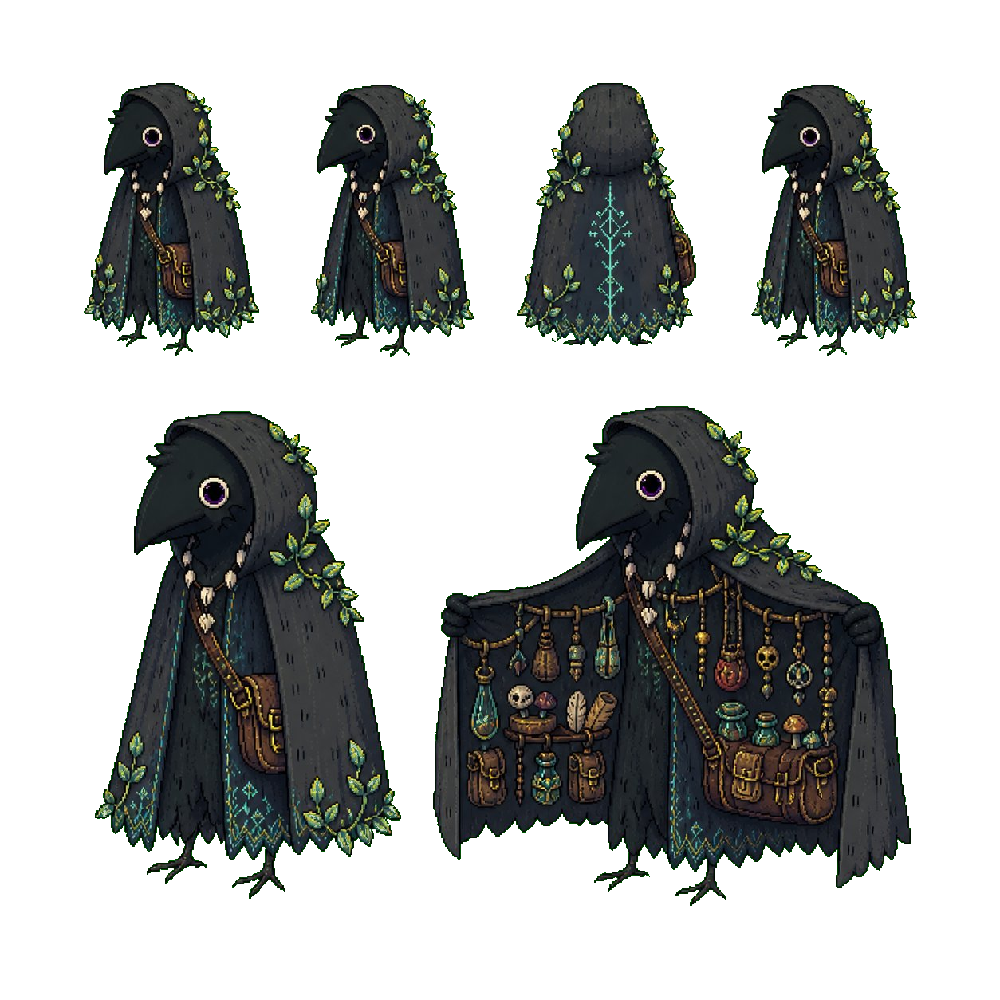
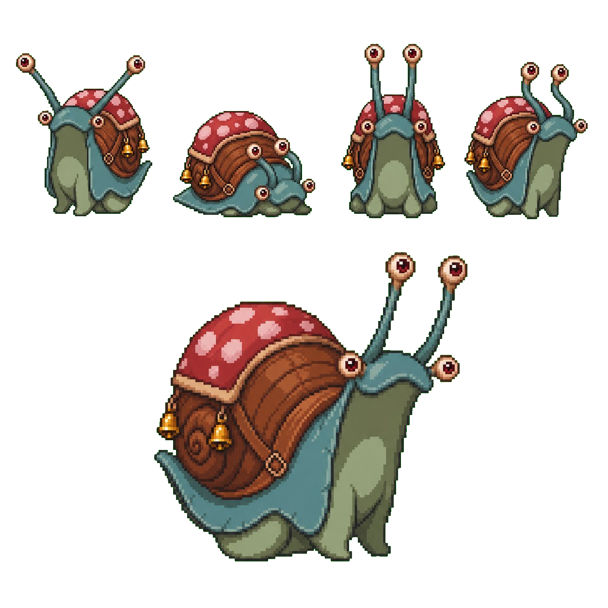
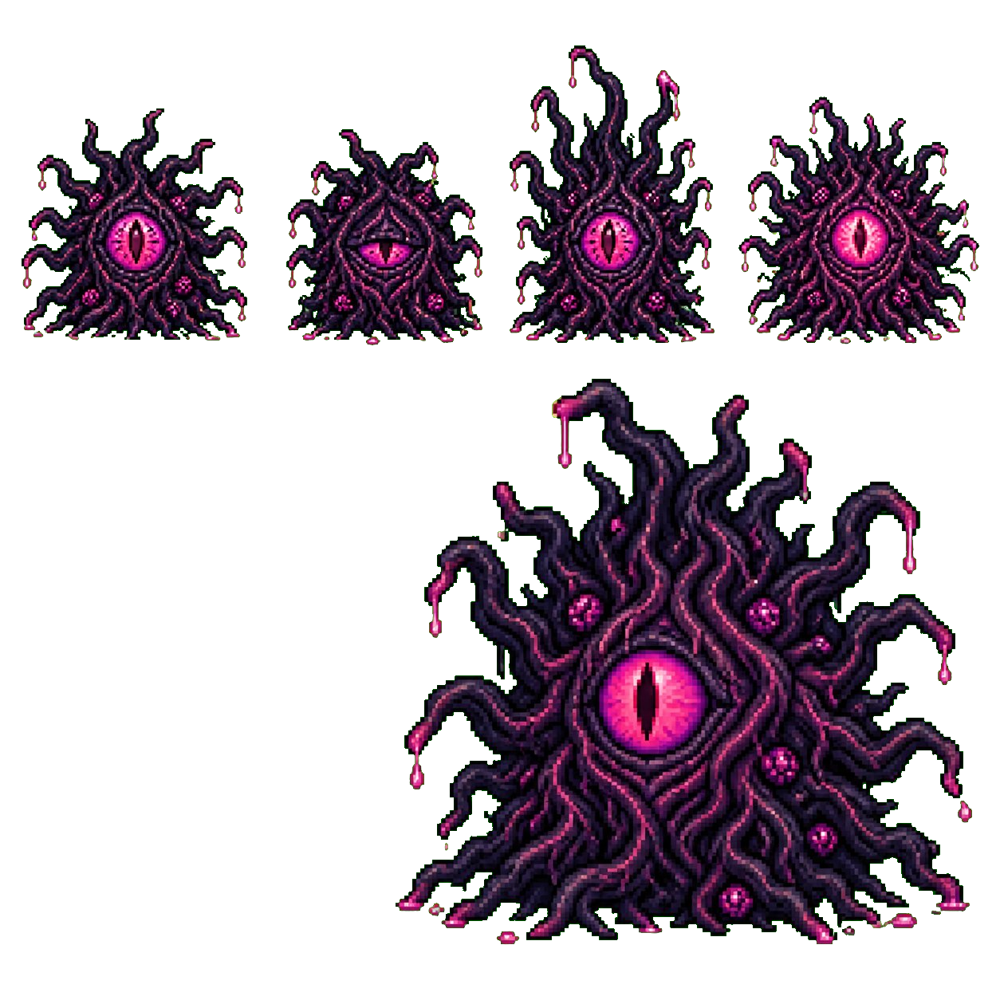

# Mycelus Tales

Um experimento indie em Godot sobre memoria, fungos conscientes e mundos pequenos cheios de atmosfera.

## Sobre

`Mycelus Tales` e um projeto experimental com fins educacionais, criado para estudar o processo de desenvolvimento de um jogo autoral do conceito ao prototipo jogavel.

O objetivo nao e apenas montar um vertical slice, mas aprender na pratica:

- Godot `4.6.1`
- GDScript
- organizacao de cenas e gameplay
- pipeline manual de arte para pixel art
- integracao de dialogo com Ollama local
- memoria persistente com SQLite de forma opcional

## Identidade

O projeto parte de uma ideia simples: um mundo onde fungos desenvolveram consciencia e a rede micelial funciona como memoria coletiva.

O tom busca:

- fantasia contemplativa
- melancolia leve
- estranheza acolhedora
- silhuetas legiveis e personagens com olhar presente

## Personagens

### Protagonista

Pequeno viajante conectado a rede, usado como ancora de escala, exploracao e leitura do mundo.

### Anciao

Figura de memoria e orientacao. Nao explica demais; sugere caminhos.

### Mercador Ambiguo

Presenca util e inquietante ao mesmo tempo, com leitura forte de silhueta e misterio.

### Caracol Companheiro

Estranho, silencioso e memoravel. Uma presenca que ajuda a definir o carater do mundo.

### Corrupcao Radicular

Ameaca principal do slice inicial, pensada como distorcao organica da propria rede.

## Estado atual

- base do projeto abre no Godot `4.6.1`
- vertical slice inicial com player, NPC, combate e bioma principal
- scripts ajustados para um parse mais estavel nessa versao do editor
- assets organizados entre referencia e uso final

## Estrutura

- `project.godot`: ponto de entrada do projeto
- `scenes/`: mundo, entidades, inimigos e UI
- `scripts/`: gameplay, dialogo, combate e integracoes
- `data/`: biomas, NPCs, inimigos e fallbacks
- `assets/source-sheets/`: estudos, variacoes e folhas de trabalho
- `assets/sprites/`: sprites finais usados no jogo
- `docs/`: guias curtos de producao e uso
- `references/`: material local de apoio, handoff e arquivos brutos fora do versionamento

## Fluxo de arte

A producao visual foi organizada para manter o projeto simples e manual:

- `assets/source-sheets/` guarda referencia, variacoes e material de trabalho
- `assets/sprites/` guarda apenas o que deve entrar no jogo
- `references/` pode guardar handoff, exportacoes antigas e folhas brutas sem poluir a raiz do projeto

O fluxo recomendado e limpar, padronizar e exportar os sprites no Aseprite antes da importacao no Godot.

## Rodando o projeto

1. Abra `project.godot` no Godot.
2. Rode `res://scenes/main.tscn`.
3. Importe ou ajuste sprites em `assets/sprites/`.
4. Substitua placeholders conforme o projeto evoluir.

Se quiser usar memoria persistente real, ative o addon de SQLite. Se quiser dialogo local, rode o Ollama com um modelo compativel.

## Documentacao interna

- guia de personagens: [docs/personagens.md](docs/personagens.md)
- setup e execucao: [docs/rodar-projeto.md](docs/rodar-projeto.md)
- uso de sheets manuais: [docs/usar-sheets-manuais.md](docs/usar-sheets-manuais.md)

## Nota de desenvolvimento

Este repositorio funciona como laboratorio de aprendizado indie. Parte do valor do projeto esta justamente em registrar tentativa, iteracao, refinamento visual e construcao de pipeline ao longo do caminho.
